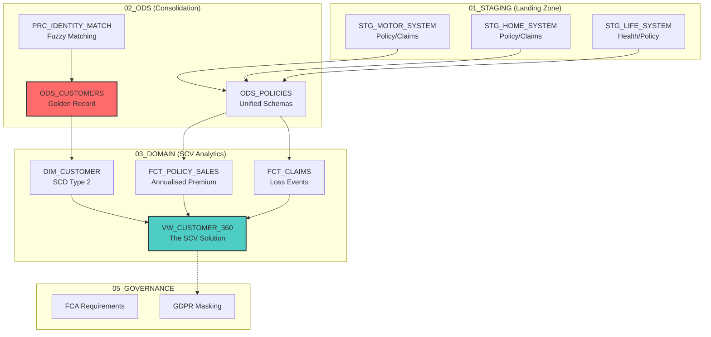

# SecureLife UK Insurance Data Platform (SCV)

[](https://www.snowflake.com/)
[](https://www.fca.org.uk/)
[](https://github.com/ElliottFairhall/securelife-database)


An enterprise-grade Single Customer View (SCV) platform for **SecureLife UK**, integrating disparate policy and claims
data across Motor, Home, and Life insurance sectors. The platform utilises a Medallion Architecture to deliver a "Golden
Record" of customer identity, risk, and value.

______________________________________________________________________

## Key Features

- **Single Customer View (SCV)** - Unified profile linking policyholders across different business lines using fuzzy
  matching logic.
- **Medallion Architecture** - Standardized three-layer design: Staging (Landing), ODS (Operational Store), and Domain
  (Analytics).
- **Insurance Specific Modelling** - Support for complex relations between Policyholders, Named Drivers, Beneficiaries,
  and Claims.
- **UK Compliance & Localisation** - Built-in support for UK Insurance Premium Tax (IPT), UK Postcode hierarchies, and
  FCA regulatory requirements.
- **PII & Sensitive Data Governance** - Advanced masking policies for medical history and row-level security for claims
  handlers.
- **Historical Accuracy (SCD Type 2)** - Comprehensive tracking of customer address changes, loyalty tiering, and policy
  status history.

______________________________________________________________________

## Architecture



______________________________________________________________________

## Dimensional Model

### Dimensions

| Table                | SCD Type | Purpose                                      |
| -------------------- | -------- | -------------------------------------------- |
| **DIM_DATE**         | Type 0   | Static UK calendar with insurance periods    |
| **DIM_CUSTOMER**     | Type 2   | The Golden Record (Address history, contact) |
| **DIM_POLICY_TYPE**  | Type 1   | Product catalogue (Comprehensive, Life, etc) |
| **DIM_GEOGRAPHY**    | Type 0   | UK Postcode risk scoring zones               |
| **DIM_CLAIM_STATUS** | Type 0   | Unified claim lifecycle states               |

### Fact Tables

| Table                | Grain            | Key Measures                                  |
| -------------------- | ---------------- | --------------------------------------------- |
| **FCT_POLICY_SALES** | Policy Inception | Premium (Ex-tax), IPT, Commission, Total Bill |
| **FCT_CLAIMS**       | Claim Event      | Reserve Amount, Paid Out, Excess, Reimbursed  |
| **FCT_RENEWALS**     | Renewal ID       | Retention flag, Price change %, Tenure months |
| **FCT_INTERACTIONS** | Customer Contact | NPS score, Duration, Channel (Web, Phone)     |

______________________________________________________________________

## The SCV "Solution"

The heart of the project is the `VW_CUSTOMER_360` view. This view aggregates state across the customer journey:

1. **Identity**: The resolved Golden Record across Motor, Home, and Life.
2. **Product Density**: Count of active products (e.g., 2 = "Multi-policy customer").
3. **Total Customer Value (TCV)**: Sum of annualised premiums across all active policies.
4. **Risk Profile**: Total loss ratio (Claims Paid / Premiums Paid) over the last 3 years.
5. **Propensity**: Renewal due dates and conversion scores.

______________________________________________________________________

## UK Localisation & Standardisation

- **Spelling**: UK English (e.g., "Centred", "Organised", "Programme").
- **Currency**: Great British Pounds (GBP £).
- **Timezone**: London (GMT/BST).
- **Tax**: Standard UK IPT (12%) and Higher Rate IPT (20%) calculation logic.

______________________________________________________________________

## Project Structure

```text
securelife-database/
├── README.md                          # The Solution Overview
├── Brief/
│   ├── Company Profile                # Business context and history
│   └── Logo.png                       # Brand identity
├── Schema/
│   └── Schema.dbml                    # Insurance ERD
├── Snowflake/
│   ├── 00_INIT/                       # Database and Schema initialization
│   ├── 01_STAGING/                    # Motor, Home, and Life source landing
│   ├── 03_DOMAIN/                     # Dimensional model and SCV views
│   └── 05_GOVERNANCE/                 # Risk and Privacy security policies
└── Test_Data/
    └── LOAD_INSURANCE_DATA.sql        # Sample records for verification
```

______________________________________________________________________

## Author

**Elliott Fairhall**

- **Project**: SecureLife SCV Demo
- **Style Reference**: Inspired by TechTrend Retail Data Platform
